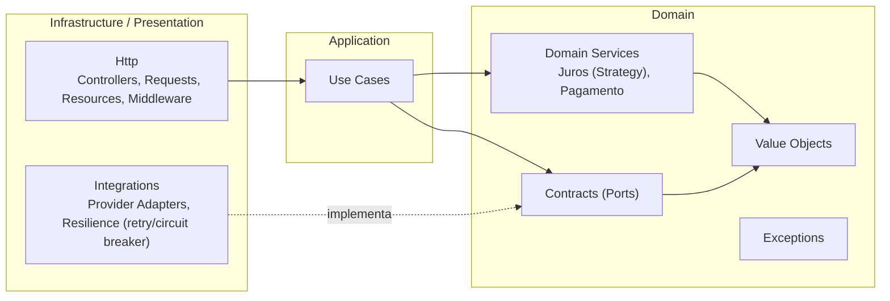
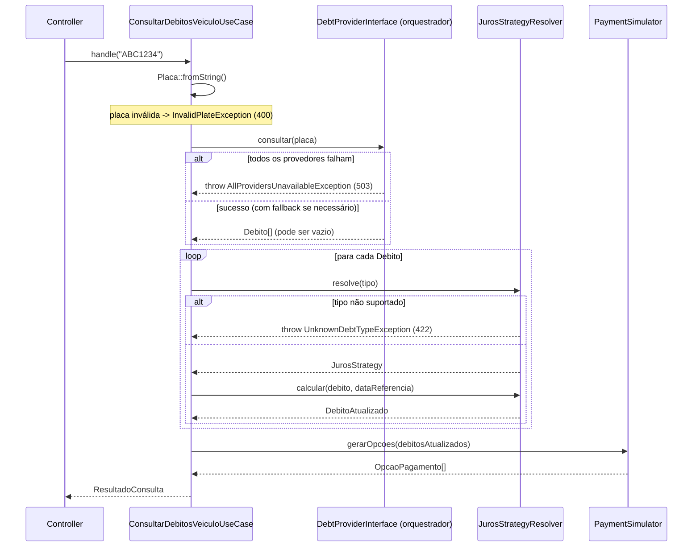

# Design 00 — Arquitetura

**Status:** Base para os design docs 01–06.
**Requisitos relacionados:** REQ-NFR-01, REQ-NFR-02, REQ-PROV-05, REQ-NORM-02,
REQ-JUROS-07, REQ-NFR-05.

## 1. Objetivo

Definir a organização em camadas (DDD + Ports & Adapters + Clean
Architecture), o fluxo do Use Case principal, e as decisões transversais que
os demais design docs (01–06) vão assumir como dadas.

## 2. Camadas e Regra de Dependência

Três camadas, com dependências sempre apontando para dentro (em direção ao
Domain). Nada em `Domain` conhece Laravel.



- **Domain**: regras de negócio puras (PHP puro, sem `Illuminate\*`). Define
  os *ports* (interfaces) que o resto do sistema deve implementar/consumir.
- **Application**: Use Cases — orquestram o Domain através dos ports.
  Não sabem nada de HTTP, JSON, XML, Guzzle etc.
- **Infrastructure/Presentation**: `Integrations` (adapters dos provedores +
  resiliência) e `Http` (controllers, requests, resources). Implementam os
  ports do Domain e traduzem para/de HTTP.

## 3. Estrutura de Pastas

```
app/
  Domain/
    ValueObjects/        # Placa, Debito, DebitoAtualizado, OpcaoPagamento...  (Design 01)
    Services/
      Juros/              # Strategies de juros (Design 01)
      Pagamento/          # PIX / Cartão (Design 02)
    Contracts/            # Ports (Design 01/03/04)
    Exceptions/            # InvalidPlate, UnknownDebtType, etc. (Design 01)

  Application/
    UseCases/
      ConsultarDebitosVeiculoUseCase.php   # ver Seção 4

  Integrations/
    Providers/             # ProviderAJsonAdapter, ProviderBXmlAdapter (Design 03)
    Resilience/             # Fallback orchestrator, retry, circuit breaker (Design 04)
    Clock/
      ConfigReferenceDateProvider.php       # ver Seção 5.2

  Http/
    Controllers/            # Design 05
    Requests/
    Resources/
    Middleware/

  Providers/                # Service Providers NATIVOS do Laravel (wiring/DI)
    DomainServiceProvider.php               # ver Seção 5.3
```

> Atenção ao nome: `app/Providers/` (Service Providers do framework Laravel,
> usados para *bind* de interfaces → implementações) é diferente de
> `app/Integrations/Providers/` (os "Provedores A/B" de dados do enunciado).
> Mantemos os dois propositalmente separados para não confundir.

## 4. Fluxo Principal — `ConsultarDebitosVeiculoUseCase`



Assinatura (PHP puro, sem dependência do Laravel):

```php
namespace App\Application\UseCases;

final class ConsultarDebitosVeiculoUseCase
{
    public function __construct(
        private DebtProviderInterface $provider,
        private JurosStrategyResolverInterface $jurosResolver,
        private PaymentSimulatorInterface $paymentSimulator,
        private ReferenceDateProviderInterface $referenceDate,
    ) {}

    /**
     * @throws InvalidPlateException
     * @throws AllProvidersUnavailableException
     * @throws UnknownDebtTypeException
     */
    public function handle(string $placaInput): ResultadoConsulta
    {
        $placa = Placa::fromString($placaInput);
        $dataReferencia = $this->referenceDate->dataReferencia();

        $debitos = $this->provider->consultar($placa);

        $debitosAtualizados = array_map(
            fn (Debito $d) => $this->jurosResolver
                ->resolve($d->tipo)
                ->calcular($d, $dataReferencia),
            $debitos,
        );

        $opcoes = $this->paymentSimulator->gerarOpcoes($debitosAtualizados);

        return ResultadoConsulta::montar($placa, $debitosAtualizados, $opcoes);
    }
}
```

> Nota sobre a decisão da Seção 6.1 do `requirements.md` (fail-fast no
> `unknown_debt_type`): como `array_map` é executado eagerly, o primeiro
> tipo desconhecido já lança a exceção e interrompe o processamento —
> nenhum total parcial é calculado/retornado. Isso é o comportamento
> desejado.

`ResultadoConsulta::montar()` (factory estático) calcula `total_original` e
`total_atualizado` somando os `DebitoAtualizado[]` — fica detalhado no
Design 01 junto dos demais Value Objects.

## 5. Decisões Transversais

### 5.1 Precisão monetária

`brick/math` (`BigDecimal`) em todo o `Domain` e `Application`. Conversão
para `string` (HALF_UP, 2 casas) acontece apenas na borda — nas
`Http/Resources` ao montar o JSON de resposta. Nenhum `float` circula no
domínio. (Detalhado no Design 01.)

### 5.2 Data de referência (`2024-05-10T00:00:00Z`)

Em vez de um valor fixo "hardcoded" dentro do Use Case (o que dificultaria
testes com outras datas), introduzimos um port pequeno:

```php
namespace App\Domain\Contracts;

interface ReferenceDateProviderInterface
{
    public function dataReferencia(): \DateTimeImmutable; // UTC, sem hora
}
```

Implementação em `Integrations/Clock/ConfigReferenceDateProvider`, lendo de
`config('debitos.data_referencia')`. Em testes, usa-se uma implementação
fake/in-memory que retorna qualquer data desejada — sem precisar mockar
`Carbon::now()` global.

### 5.3 Composition Root (wiring)

`app/Providers/DomainServiceProvider.php` (Service Provider nativo do
Laravel) é o único lugar onde interfaces do `Domain/Contracts` são ligadas
às implementações concretas:

```php
$this->app->bind(JurosStrategyResolverInterface::class, JurosStrategyResolver::class);
$this->app->bind(PaymentSimulatorInterface::class, PagamentoSimulator::class);
$this->app->bind(ReferenceDateProviderInterface::class, ConfigReferenceDateProvider::class);

$this->app->bind(DebtProviderInterface::class, function () {
    // monta a cadeia: CircuitBreaker(Retry(Adapter)) por provedor,
    // envolvida pelo ProviderFallbackOrchestrator — Design 04
});
```

### 5.4 Tratamento de erros (Exception → HTTP)

Mapeamento centralizado (handler global do Laravel — `bootstrap/app.php`
`->withExceptions()` no Laravel 11/12). Controllers **não** fazem
try/catch — apenas o Use Case lança, o handler global traduz:

| Exceção (Domain) | HTTP | Body |
|---|---|---|
| `InvalidPlateException` | 400 | `{"error":"invalid_plate"}` |
| `UnknownDebtTypeException` | 422 | `{"error":"unknown_debt_type","type":"<TIPO>"}` |
| `AllProvidersUnavailableException` | 503 | `{"error":"all_providers_unavailable"}` |

> **Nota para o Design 05:** o `FormRequest` do endpoint NÃO deve validar o
> formato da placa via regra/regex. Formato de placa é invariante do Value
> Object `Placa` (Domain) — se o `FormRequest` validasse isso, o Laravel
> responderia no formato padrão dele (`{"message": ..., "errors": {...}}`,
> HTTP 422), conflitando com `{"error":"invalid_plate"}` (HTTP 400) exigido
> por REQ-INPUT-02. O `FormRequest` se limita a garantir que `placa` é
> string presente; a validação de formato ocorre em `Placa::fromString()`,
> dentro do Use Case.

Detalhado no Design 05 (API/HTTP).

### 5.5 Testes

- **Pest** como framework de testes (já padrão em projetos novos Laravel;
  skill `pest-testing` do Laravel Boost cobre convenções).
- `Domain` e `Application`: testes unitários puros (sem `RefreshDatabase`,
  sem boot de HTTP — instanciam classes diretamente).
- `Http`: testes de feature (request → response JSON), incluindo os
  cenários de fallback/erro da tabela de Cenários de Aceite do
  `requirements.md`.

**Convenção: teste de estado, não de interação.** Por padrão, os testes
seguem o estilo "classicista" (Kent Beck) — exercitam a API pública e fazem
asserção sobre o **resultado** (valor de retorno, propriedades do objeto,
JSON da resposta), não sobre **como** o código chegou lá (quais métodos
internos foram chamados, quantas vezes, em que ordem).

- `Domain` (Strategies, VOs, Calculators): funções puras, sem colaboradores
  para mockar. Teste = "dado um `Debito` + data de referência, então
  `DebitoAtualizado` tem estes valores". O algoritmo interno pode ser
  reescrito (extrair métodos, reordenar operações de `BigDecimal`) sem
  quebrar o teste, desde que o resultado seja o mesmo.
- `Application` (`ConsultarDebitosVeiculoUseCase`): para isolar do Laravel,
  usar **Fakes** dos 4 ports (ex: `FakeDebtProvider` retornando um array
  fixo de `Debito`, ou lançando `AllProvidersUnavailableException`) — não
  mocks com `shouldReceive(...)->once()`. Assertar sobre o
  `ResultadoConsulta` retornado (estado), não sobre quantas vezes cada port
  foi chamado.
- `Http`: testes de feature já são teste de comportamento por definição —
  request real → resposta JSON real, sem conhecer nenhuma classe interna.

Mocks/spies de interação só se justificam quando a *própria chamada* é o
requisito observável (ex: "um e-mail foi enviado") — não é o caso de nenhum
componente deste projeto.

**Teste rápido:** se o interior de uma classe for reescrito (mantendo
assinatura pública e contrato) e o teste quebrar mesmo assim, é teste de
implementação — revisar.

### 5.6 `JurosStrategyResolver` e OCP

Para cumprir REQ-JUROS-07 (novo tipo de débito = nova Strategy, sem alterar
as existentes), o Resolver **não** usa `match`/`switch` por tipo — ele
recebe a lista de Strategies por injeção e itera perguntando `suporta()`:

```php
final class JurosStrategyResolver implements JurosStrategyResolverInterface
{
    /** @param JurosStrategyInterface[] $strategies */
    public function __construct(private readonly array $strategies) {}

    public function resolve(string $tipoDebito): JurosStrategyInterface
    {
        foreach ($this->strategies as $strategy) {
            if ($strategy->suporta($tipoDebito)) {
                return $strategy;
            }
        }

        throw new UnknownDebtTypeException($tipoDebito);
    }
}
```

A lista de Strategies é montada no `DomainServiceProvider` (Seção 5.3):

```php
$this->app->bind(JurosStrategyResolverInterface::class, fn ($app) => new JurosStrategyResolver([
    $app->make(IpvaJurosStrategy::class),
    $app->make(MultaJurosStrategy::class),
    // novo tipo: adicionar a Strategy aqui — Resolver e Strategies
    // existentes permanecem intocados.
]));
```

> Adicionar uma linha aqui é alteração no *composition root*, não na lógica
> de negócio — é o ponto do sistema que, por definição, conhece todas as
> peças concretas. O OCP se aplica ao Resolver e às Strategies, não à
> montagem do grafo de dependências.

### 5.7 Interfaces com implementação única — trade-off consciente

`JurosStrategyResolverInterface` e `PaymentSimulatorInterface` hoje têm uma
única implementação concreta cada. Pela leitura mais estrita de YAGNI/ISP,
isso poderia ser visto como abstração prematura.

Mantemos os ports porque:

- O `ConsultarDebitosVeiculoUseCase` (Application) depende apenas de
  `Domain/Contracts` — nunca de classes concretas do Domain. É isso que
  permite testar o Use Case com fakes/stubs, sem montar o grafo real de
  Strategies/Calculators.
- Torna explícita, no código, a fronteira Ports & Adapters pedida no
  enunciado (REQ-NFR-01).

Trade-off assumido: uma camada extra de indireção para algo que, hoje, tem
só uma implementação real. Decisão consciente — vai para o README como
justificativa de design.

## 6. Padrões de Projeto Utilizados

| Padrão | Onde | Por quê / Requisito |
|---|---|---|
| **Value Object** | `Placa`, `Debito`, `DebitoAtualizado`, money via `BigDecimal` | Imutabilidade, validação encapsulada |
| **Strategy** | `JurosStrategyInterface` (Ipva/Multa) | REQ-JUROS-07 — novo tipo de débito = nova classe, sem tocar nas existentes |
| **Adapter** | `ProviderAJsonAdapter`, `ProviderBXmlAdapter` | REQ-PROV-05/NORM-01 — normaliza formatos externos pro modelo canônico |
| **Composite / Chain of Responsibility** | `ProviderFallbackOrchestrator` | REQ-PROV-02 — tenta provedores em ordem até um responder |
| **Decorator** | Retry / Circuit breaker em torno dos adapters | REQ-PROV-06/07 (nice-to-have) |
| **Ports & Adapters (Hexagonal)** | `Domain/Contracts` vs `Integrations`/`Http` | REQ-NFR-01 |
| **Use Case / Application Service** | `ConsultarDebitosVeiculoUseCase` | REQ-NFR-02 — único orquestrador do fluxo |
| **Factory/Resolver** | `JurosStrategyResolver` (ver §5.6 — OCP-compliant) | Resolve a Strategy certa por tipo, lança `UnknownDebtTypeException` |

Essa tabela vai praticamente direto para a seção "Decisões técnicas /
Padrões utilizados" do README (REQ-DELIV-02).

## 7. Próximos Design Docs

| Doc | Escopo | Depende de |
|---|---|---|
| `01-domain-model.md` | Value Objects completos, Strategies de juros (IPVA/MULTA), exceções | Este doc |
| `02-payment-simulation.md` | PIX, Cartão (PMT), `PagamentoSimulator`, agrupamento TOTAL/SOMENTE_\<TIPO\> | 01 |
| `03-provider-adapters.md` | `ProviderAJsonAdapter` (JSON), `ProviderBXmlAdapter` (XML, incl. `<debts/>`) | 01 |
| `04-resilience-orchestration.md` | `ProviderFallbackOrchestrator`, retry, circuit breaker, simulação de falhas | 03 |
| `05-api-http.md` | Rotas, `ConsultaVeiculoController`, Form Request, Resource, Exception Handler | 01, 02 |
| `06-observability.md` | Logs estruturados, mascaramento de placa (LGPD) | 01, 05 |

`01`, `02` e `03` podem ser feitos/implementados em paralelo — todos
dependem apenas dos contratos definidos em `01` (que reaproveita o conteúdo
da Spec 1 já produzida).

## 8. Rastreabilidade (parcial)

| Requisito | Componente |
|---|---|
| REQ-NFR-01 | Estrutura de pastas (Seção 3) |
| REQ-NFR-02 | `ConsultarDebitosVeiculoUseCase` (Seção 4) |
| REQ-JUROS-06 | Fluxo fail-fast no Use Case (Seção 4, nota) |
| REQ-PROV-05 | `DebtProviderInterface` + Adapters (Seção 2, Design 03) |
| REQ-NORM-02 | `JurosStrategyResolver` extensível (Design 01) |
| REQ-NFR-05 | Tabela de padrões (Seção 6) |
